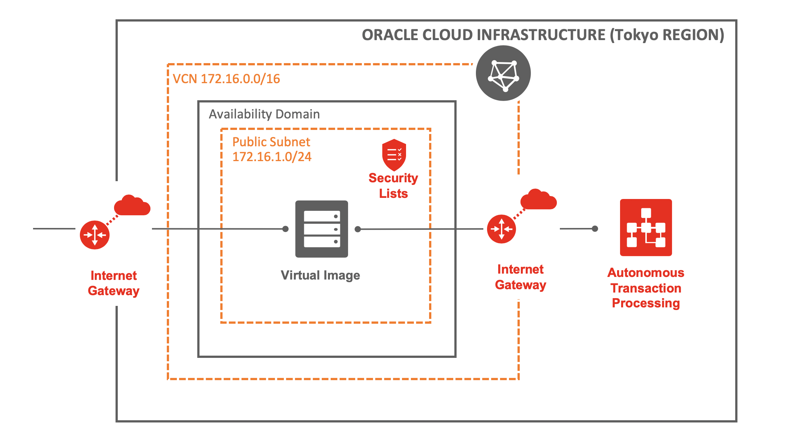

# どんな環境を作る？

Oracle Cloud InfrastructureにてComputeとAutonomous Transaction Processingを作成する。



# 環境を作成・更新するコマンド

dockerから実行する場合、tokyo-compute-atp配下のREADME.mdがあるディレクトリで

```
$ docker run -it -v $PWD:/app/ -w /app/terraform/ hashicorp/terraform:full apply
```

（`terraform apply`コマンドが実行される）

# 環境を削除するコマンド

dockerから実行する場合、README.mdがあるディレクトリで

```
$ docker run -it -v $PWD:/app/ -w /app/terraform/ hashicorp/terraform:full destroy
```

（`terraform destroy`コマンドが実行される）

# 事前準備

- Oracle CloudのCompartmentを作成しておく
- sshできるツールを用意しておく
  - WindowsであればTeraterm / GitBashを使うのがいいのでは。
- Dockerをインストールしておく
  - 各種ツールをインストールするのが面倒だったので、すべてのコマンドをDocker経由で実行している

# 手順

## 0. ネットワークの設定をする

プロキシの設定をするか、プロキシを挟まないネットワークにアクセスする

（私は公私混同パソコンなので、携帯とベアリングして、プロキシのないネットワークにアクセスしています。。。）

## 1. API Keyを作成する

```
$ mkdir key
$ docker build ./ -t oci-api-key
$ docker run --name oci-api-key -it oci-api-key bash
$ docker cp oci-api-key:/root/.oci/ key/
```

keyディレクトリに`.oci`フォルダーがコピーされる。

通常の手順で実行する場合は[こちら](https://docs.cloud.oracle.com/iaas/Content/API/Concepts/apisigningkey.htm#two
)

## 2. 作成したAPI KeyをOracle Cloudへ適用する

手順は[こちら](https://docs.cloud.oracle.com/iaas/Content/API/Concepts/apisigningkey.htm#How2)

## 3. 環境設定ファイルを作成する

`prod.auto.tfvars`へ環境設定を反映させる

- tenancy_ocid
- user_ocid
- compartment_ocid
- fingerprint

### tenancy_ocid

Menu > Administration > Tenancy details

- Tenancy Information
  - OCID

### user_ocid

Menu > Identity > Users > 自分のアカウントを選択

- User Information
  - OCID

### compartment_ocid

Menu > Identity > Compartments > 任意のコンパートメントを選択

- Compartment Information
  - OCID

### fingerprint

Menu > Identity > Users > 自分のアカウントを選択

- API Keys
  - Fingerprint

It looks something like this: `12:34:56:78:90:ab:cd:ef:12:34:56:78:90:ab:cd:ef`

## 4. sshキーを作成する

sshキーを作成して、`key/.ssh/`ディレクトリに格納する

sshキーの公開鍵の名前が`id_rsa.pub`でない場合は、`prod.auto.tfvars`ファイルの`ssh_public_key_path` を修正する

sshログインする時は

```
$ ssh -i key/.ssh/id_rsa opc@<public ip>
```

## 5. Terraformを初期化する

このREADME.mdがあるディレクトリでコマンドを実行

```
$ docker run -it -v $PWD:/app/ -w /app/terraform/ hashicorp/terraform:full init
```

（`terraform init`コマンドが実行される）
